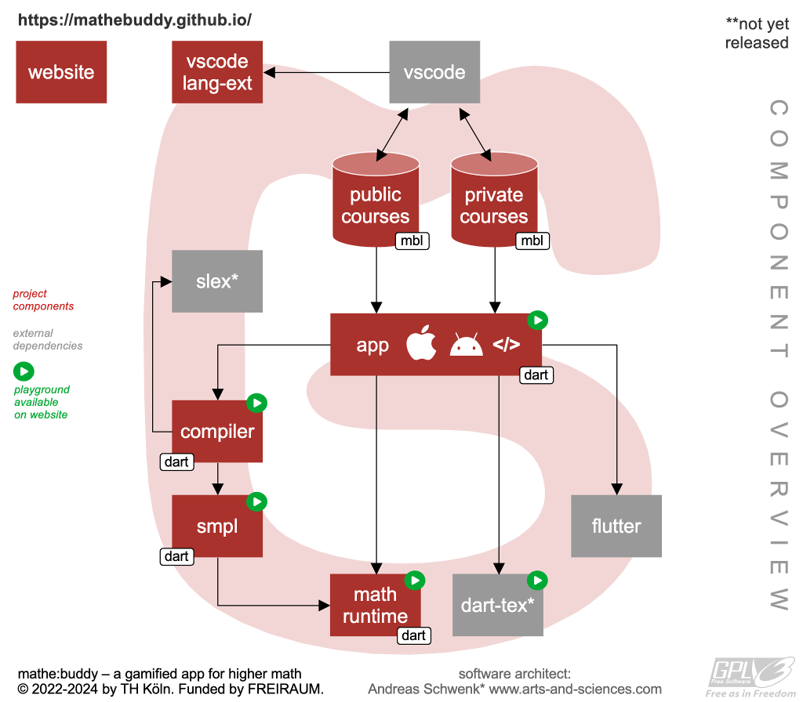

# mathe:buddy

Official website with simulator and playgrounds: https://mathebuddy.github.io/mathebuddy/

## Developers Info

This repository implements all components of the `mathe:buddy` app.

<!-- for the iOS App Store and Google Playground.-->



Head to the readme files in the subdirectories.

## File Structure

| Path     | Description                                       |
| -------- | ------------------------------------------------- |
| .vscode/ | Visual Code Project Settings                      |
| app/     | Implementation of the App with Flutter            |
| bin/     | Scripts                                           |
| doc/     | Documentation of SMPL, MBL, MBCL                  |
| docs/    | Website: https://mathebuddy.github.io/mathebuddy/ |
| ext/     | External Components                               |
| img/     | Original image files                              |
| lib/     | Implementation of components (math-runtime, ...)  |
| cmd.sh   | Administration script for developers              |

## Development

Use [VSCode](https://code.visualstudio.com) for editing source code and make sure you install ALL recommended extensions (click on `Extensions` on the left symbol div and type `@recommended` in the search field. Then click on `Install` on each extension that is not yet installed).

### Dependencies

_Other operating systems than Debian and macOS are not yet supported._

<!-- TODO: android SDK, XCode, ... -->

- Debian based Linux (e.g. Ubuntu)

  ```
  sudo apt install python3 snapd pandoc
  sudo snap install flutter --classic
  ```

- macOS

  First install the [brew package manager](https://brew.sh).

  ```
  brew install git python3 flutter pandoc
  ```

Then run `flutter doctor` in a terminal window and install all listed dependencies. Android and XCode can be skipped, if you only like to compile and run `mathe:buddy` simulator.

### Getting mathe:buddy

You now need to clone the following _mathe:buddy_ repositories. Replace `YOUR_FAVORITE_DIRECTORY` by a local directory on your disk.

> TIP: use [GitHub Desktop](https://desktop.github.com) to clone the repositories (refer to the end of this document).

```
cd YOUR_FAVORITE_DIRECTORY
git clone https://github.com/mathebuddy/mathebuddy.git
git clone https://github.com/mathebuddy/mathebuddy-public-courses.git
```

Developers of the core team should use a SSH key pair; see
[https://docs.github.com/en/authentication/connecting-to-github-with-ssh](https://docs.github.com/en/authentication/connecting-to-github-with-ssh); and also clone the private repository:

```
cd YOUR_FAVORITE_DIRECTORY
git clone git@github.com:mathebuddy/mathebuddy.git
git clone git@github.com:mathebuddy/mathebuddy-public-courses.git
git clone git@github.com:mathebuddy/mathebuddy-private-courses.git
```

> WARNING: Never(!!) clone to iCloud / GoogleDrive / OneDrive / NextCloud / Sciebo / ...!

### Build

(TODO: this section will be added soon...)

### Running the website locally

```
cd docs
python3 -m http.server 8000
```

Open `http://localhost:8000` in your favorite browser. You may choose another port than `8000`.

## Repository List

<!--List of all repositories
Also consider the other repositories of this GitHub account. You will find a list below.-->

- https://github.com/mathebuddy/mathebuddy

  iOS and Android App (implemented with Flutter)

- https://github.com/mathebuddy/mathebuddy-public-courses

  Free and Open Source Math Courses

<!--
- https://github.com/mathebuddy/mathebuddy-downloads

  Downloadable toolchains and data for the mathe:buddy app (e.g. VSCode Plugins)

- https://github.com/mathebuddy/mathebuddy-compiler

  Course Description Language Compiler (converts human-readable course definitions into a machine-oriented language)

- https://github.com/mathebuddy/mathebuddy-smpl

  Simple Math Programming Language (SMPL) for the Web (used to create random math questions)

- https://github.com/mathebuddy/mathebuddy-simulator

  Course Simulator with Debugging Features (used in the web IDE and the VSCode plugins)

- https://github.com/mathebuddy/mathebuddy-math-runtime

  Simple Math Runtime for the App (partly based on SMPL)

- https://github.com/mathebuddy/mathebuddy-ide

  Web Editor to compose Courses for the App

- https://github.com/mathebuddy/mathebuddy-vscode-lang-ext

  Language Extension for Visual Studio Code (syntax and semantical highlighting)

- https://github.com/mathebuddy/mathebuddy-vscode-sim-ext

  Simulator Extension for Visual Studio Code (simulation)

- https://github.com/mathebuddy/mathebuddy-website

  Website for the MatheBuddy App (https://app.f07-its.fh-koeln.de)
-->
